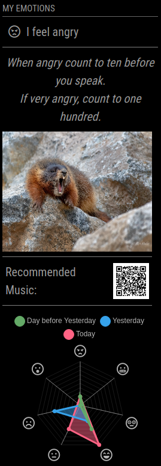

# MMM-Emotion

A module that makes MagicMirror² recognize your emotions.

## Status

Development finished, no further maintenance.

## Description

With this module, MagicMirror can recognize your current emotion using the Raspberry Pi Camera. You can choose between two Deep Learning models for emotion recognition: [DeepFace](https://github.com/serengil/deepface) or a [model taken from Kaggle](https://www.kaggle.com/models/missaouimohamedamine/facial-emotion-recognition-model). Several ways to show these emotions can be configured. Optionally, a breathing exercise can be displayed for certain emotions.

This modules implementation is partly based on [MMM-Facial-Recognition](https://github.com/paviro/MMM-Facial-Recognition), [MMM-Emotion-Detection](https://github.com/joanaz/MMM-Emotion-Detection) and [MMM-Face-Reco-DNN
](https://github.com/nischi/MMM-Face-Reco-DNN), so check those out if you want to create a similar module.

This module was tested on a Raspberry Pi Model 3B and runs reasonably well with a detection interval of ten minutes. If you have an older model, you might run into performance issues, with newer models you might get away with shorter intervals.

## Example



## Dependencies

- Installation of [MagicMirror<sup>2</sup>](https://github.com/MichMich/MagicMirror)

### Hardware

- [Raspberry Pi Camera](https://www.raspberrypi.com/documentation/accessories/camera.html)

### Node.js

These will be installed automatically when running npm install.

- python-shell
- chart.js v2
- qrcode

### Python

- [OpenCV](http://opencv.org)
- deepface
- tf_keras
- pandas
- numpy

### Depending on Configuration:

- If using the Breathing Exercise: [MMM-Breathwork](https://github.com/yashatgit/MMM-Breathwork) (set `hiddenOnStartup: true` in `config.js`)
- If using AI generated images: API Key (see below)

## Setup

### Python

#### Setting up a virtual python environment

When using Raspberry Pi OS bookworm and newer you need to use a virtual environment for running Python, otherwise you might encounter the message `error: externally-managed-environment`.

To setup the environment run `python3 -m venv mmenv` (you can use any name instead of mmenv) and activate it with `source mmenv/bin/activate`. The easiest option is to run it in the root folder (`~/`), but you can also use other directories. You can now do the following installation steps within the virtual environment. To exit the environment, simply run `deactivate`.

After the installation the environment doesn't need to be active for the module to function. For this you have to set `pythonPath` within `config.js` of this module to the python path of your virtual environment. In this example, it would be:

```javascript
{
	module: "MMM-Emotion",
	config: {
		pythonPath: "/home/medicalmirror/mmenv/bin/python3"
	...
	}
},
```

#### Installing Python packages

For the emotion recognition several Python packages need to be installed, so run in your terminal:

```
pip3 install opencv-contrib-python
pip install numpy
pip install pandas
pip install tensorflow
pip install deepface
pip install tf-keras
```

The deepface module used for emotion recognition depends on TensorFlow, so to avoid any problems when installing deepface, install TensorFlow first separately. If you run into any problems with that, verify that you use a 64-bit OS and have a look at [this tutorial](https://www.samwestby.com/tutorials/rpi-tensorflow.html).
If you get an error regarding `h5py`, try installing a previous version with `|pip install h5py==3.9.0`.

### Optional features

#### API Key for AI-generated images

If you want to use AI-generated images, you first need to create a account on [LimeWire](https://limewire.com). You can use the free plan to get started, but keep in mind the maximum number of images per day or month. At time of writing, this includes 10 credits per day, which is enough for approximatly 4 images. After that, the local images are used as backup.

After creating an account, you can find the API Key in your [settings](https://limewire.com/u/settings/api-keys) (create one if necessary).

#### Custom messages, images and songs

You can set your own messages and song recommendations in the files `custom_songs.json` and `custom_messages.json`. The messages are specified per language, using the language set in your global `config.js`. Music recommendations can for example be links to a Spotify playlist or song. The images used for each emotion are located within the directory `images` of this module. If you want to change them, simply place your images in this folder, using the names of the images there (e.g. `angry.jpg`).

## Installation

In your terminal, navigate to the modules folder and clone this repository.

```
$ cd ~/MagicMirror/modules
$ git clone https://github.com/SandraPrestel/MMM-Emotion.git
```

To install the node.js dependencies, navigate into the module folder and execute npm install:

```
$ cd MMM-Emotion
$ npm install
```

## Module configuration

Add this to your `~/MagicMirror/config/config.js`

```js
{
    module: "MMM-Emotion",
    position: "top_left",
    config: {
        emotionRecognitionModel: 'DeepFace',
        interval: 10*60,
        averageOver: 5,
        show: ['current', 'message', 'image', 'song', 'history','breath'],
        messageFile: 'custom_messages.json',
        songFile: 'custom_songs.json',
        useAIimages: true,
        apiKey: '',
        pythonPath: "python3"
    }
}
```

## Config options

| **Option**                | **Default** | **Description**                                                                                                                                                   |
| ------------------------- | ----------- | ----------------------------------------------------------------------------------------------------------------------------------------------------------------- |
| `emotionRecognitionModel` | see above   | which model to use for emotion recognition<br>Possible values: `'DeepFace'`, `Kaggle`                                                                             |
| `interval`                | see above   | How often the face recognition is done, in seconds.<br>When setting this keep in mind the AI image limit and your devices performance.                            |
| `averageOver`             | see above   | With shorter detection intervals you might want to average over the detected emotions to avoid flickering. Set the number of detections to be averaged over here. |
| `show`                    | see above   | What modules to be displayed (see screenshot).<br>Possible values: `'current'`, `'message'`, `'image'`, `'song'`, `'history'`,`'breath'`                          |
| `messageFile`             | see above   | File containing custom messages (see above)                                                                                                                       |
| `songFile`                | see above   | File containing custom music recommendations (see above)                                                                                                          |
| `useAIimages`             | see above   | Whether to use AI-generated images instead of local files (see above)                                                                                             |
| `apiKey`                  | see above   | API Key for AI-generated images (see above)                                                                                                                       |
| `pythonPath`              | see above   | Path to Python executable when using a virtual environment                                                                                                        |

## Troubleshooting

### Update this module

If you want to update this module from GitHub, run:

```
$ cd ~/MagicMirror/modules/MMM-Emotion
$ git pull
```

If you get an error message regarding local changes, execute `git reset --hard` first, this will dispose of any changes including the emotion history. If you want to keep your changes, you need to stash these before pulling, more about that [here](https://git-scm.com/docs/git-stash).

### General help

For general troubleshooting have a look at [this guide](https://gist.github.com/lavolp3/db7de8c0664ba95e8b9247ba685095fe) and [this module](https://github.com/sdetweil/MMM-Logging). MMM-Emotion prints several Log messages to help you troubleshoot problems.
